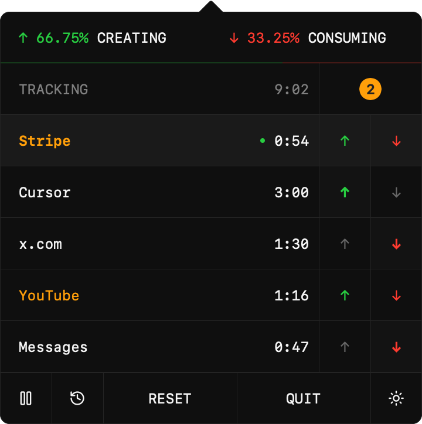
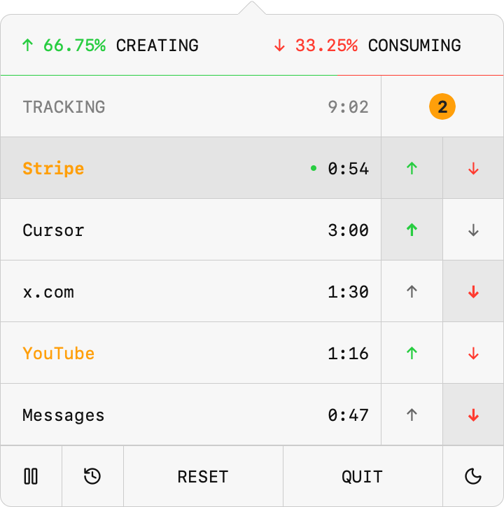

# Split

**Create more. Consume less.** A free, open-source macOS menu bar app that tracks how much of
your screen time goes to *creating* versus *consuming*, and shows the ratio in your menu bar.

<p align="center">
  
  &nbsp;&nbsp;
  
</p>

Split watches which app (or which website, in your browser) is in front, and asks you one
question per app: is this **↑ create** or **↓ consume**? Answer once and it sticks. From then on
your menu bar reads `↑ 67/33` while you're making things and `↓ 41/59` when the feed wins.

Everything stays on your Mac. There is no account, no server, no analytics. Your data is one
JSON file you can open, edit, or delete.

## How it works

1. **It tracks the active window.** Every second, the frontmost app gets one more second. In
   Safari, Chrome, Arc, Brave, Edge, Vivaldi, Opera, or Dia the active tab's domain is tracked
   instead of the browser, so `x.com` and `github.com` are separate rows.
2. **Choose ↑ create or ↓ consume once.** Unclassified rows are orange; the badge in the tracking
   row counts them, and clicking it filters the list down to what still needs an answer.
3. **The menu bar ratio updates as you work.** Green arrow while you're in a create app, red
   while you're consuming, `?` for something you haven't classified, `Ⅱ` when you're away or paused.
4. **Away time isn't counted.** No input for 60 seconds, a locked screen, sleep, or the
   screensaver all pause attribution automatically. The pause button stops it on purpose.
5. **History shows your ratio over time.** One row per day, with a green/red bar and the split.

The footer has pause, history, **RESET** (undo is offered for 8 seconds), **QUIT**, and a
light/dark toggle. Right-click the menu bar item for *Launch at Login* and to reveal the data file.

## Install

Split isn't signed with an Apple Developer ID yet, so macOS will warn the first time.

1. Download `Split.zip` from the [latest release](../../releases/latest) and unzip it.
2. Move `Split.app` to `/Applications`.
3. Right-click `Split.app` → **Open** → **Open**. (On macOS 15+, if that fails: open
   *System Settings → Privacy & Security*, scroll down, and click **Open Anyway**.)
4. When you first switch to a browser, macOS asks whether Split may control it. That's the
   Apple Events permission Split uses to read the active tab's address. Say yes to track sites
   separately; say no and the browser is tracked as one app.

Requires macOS 13 Ventura or later. Apple silicon and Intel.

**Menu bar full?** On MacBooks with a notch, macOS silently hides menu bar items it has no room
for. Split detects this and tells you on first launch. Quit an app you don't need up there (or
⌘-drag items to make room) and Split's `↑ 67/33` appears. Until then, opening Split from
Spotlight or Launchpad shows the panel in the top-right corner.

## Build from source

You need Xcode 15+ and [XcodeGen](https://github.com/yonaskolb/XcodeGen) (`brew install xcodegen`).

```bash
make            # Release build → build/Split.app
make run        # build and launch
make test       # unit tests
make release    # build/Split.zip
make snapshots  # render every panel state to build/snapshots/*.png
```

If `xcode-select -p` points at the Command Line Tools but Xcode.app is installed, the Makefile
sets `DEVELOPER_DIR` for you. To sign for distribution:

```bash
make release SIGNING_IDENTITY="Developer ID Application: Your Name (TEAMID)"
```

then notarize `build/Split.zip` with `xcrun notarytool`.

## Architecture

Swift, AppKit for the shell, SwiftUI for the panel content. No dependencies.

```
Sources/
  App/         main.swift (entry + --snapshot), AppDelegate, Snapshotter (renders panel states to PNG)
  Model/       Models (Activity, DayRecord, StoreData), Ratio (the math), Format, Store (JSON persistence)
  Tracking/    Tracker (1 s tick loop, attribution, reset/undo, day rollover)
               ActiveContext (frontmost app → activity), BrowserURLProvider (Apple Events → tab host)
               IdleMonitor (idle / lock / sleep), LaunchAtLogin
  StatusBar/   StatusItemController (menu bar title + right-click menu)
               PanelController (borderless non-activating NSPanel positioned under the item)
  UI/          Theme (tokens), PanelShape (rounded body + caret), Icons (Lucide paths), PanelView
Tests/         XCTest: ratio math, formatting, tracker behavior, persistence
```

Data lives in `~/Library/Application Support/Split/data.json`:

```json
{
  "categories": { "com.todesktop.230313mzl4w4u92": "create", "web:x.com": "consume" },
  "days": { "2026-09-15": { "activities": { "web:x.com": { "key": "web:x.com", "name": "x.com", "seconds": 90, "lastUsed": "…" } } } },
  "settings": { "theme": "dark", "hasLaunchedBefore": true }
}
```

Apps are keyed by bundle identifier, websites by `web:<host>`. Categories are global, so a
classification applies to every day, past and future.

## Design

The panel is 360×352 pt, SF Mono 12 pt, 44 pt rows, one-device-pixel rules. Colors are Apple's
system green `#28cd41`, red `#ff3b30`, and orange `#ff9f0a` on `#0f0f0f` (dark) or `#f7f7f7`
(light). The look and interaction model follow [Ratio](https://ratio.visualizevalue.com) by
Visualize Value, whose demo is the reference this app was built against. Split is an independent
reimplementation and is not affiliated with Visualize Value.

## License

MIT. Icons are from [Lucide](https://lucide.dev) (ISC).
